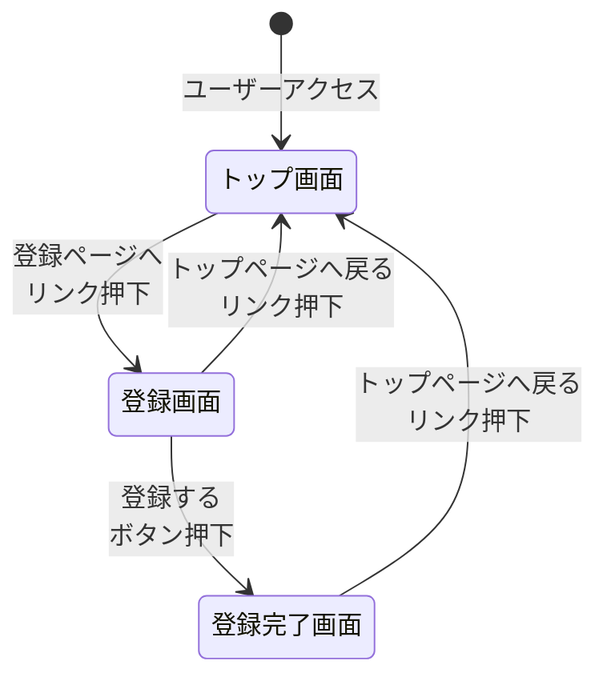
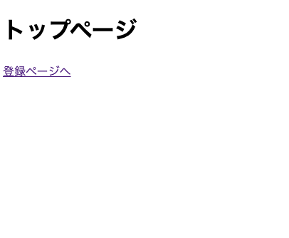
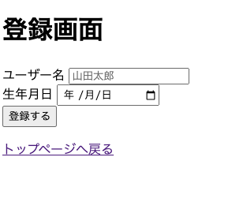
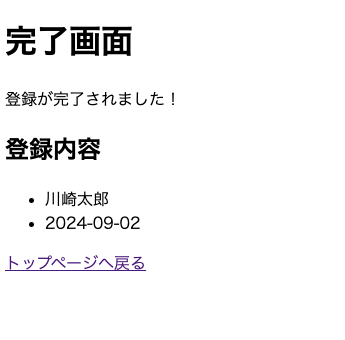

# spring-thymeleaf-demo
Spring Boot Thymeleaf 使用デモ

## 画面一覧

|No.|画面名|パス|
|:--:|--|--|
|1|トップ画面|`/`|
|2|登録画面|`/entry/input`|
|3|登録完了画面|`/entry/complete`|

## 画面遷移図

## 画面詳細定義
### 1. トップ画面
#### 画面構成
||
|--|

#### イベント
|イベント|概要|補足|
|--|--|--|
|GET|ページを表示する|

#### 部品
|種類|部品|概要|補足|
|--|--|--|--|
|リンク|登録ページへ|登録画面へ遷移する||

### 2. 登録画面
#### 画面構成
||
|--|

#### イベント
|イベント|概要|補足|
|--|--|--|
|GET|ページを表示する|

#### 部品
|種類|部品|概要|補足|
|--|--|--|--|
|入力フォーム|名前|||
|日付フォーム|誕生日|||
|ボタン|登録する|登録完了画面にPOSTで遷移||
|リンク|トップページへ戻る|トップページへ遷移する||

### 3. 登録完了画面
#### 画面構成
||
|--|

#### イベント
|イベント|概要|補足|
|--|--|--|
|POST|登録→ページ表示|

#### 部品
|種類|部品|概要|補足|
|--|--|--|--|
|リンク|トップページへ戻る|トップページへ遷移する||

